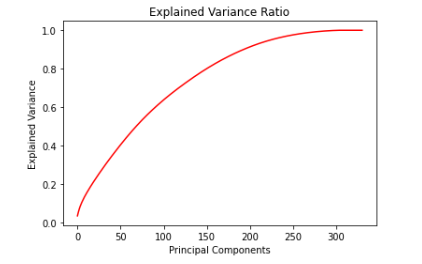
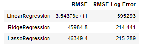
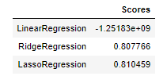
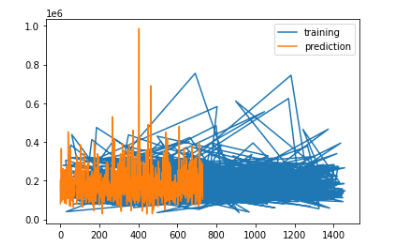

# Kaggle Project: House Prices - Advanced Regression Techniques

* Predict house sales prices given the house information from "House Prices - Advanced Regression Techniques" Kaggle challenge (https://www.kaggle.com/competitions/house-prices-advanced-regression-techniques/overview). 

## Overview
* The challenge gave 80 features including lot shape, utilities, nearby allies, and more general data about the individual houses. I used and compared 3 regression models using scikit-learn. I also preprocessed data. In the end, I used a linear regression to predict the values. I was able to roughly predict the sale prices of the houses. My score was 2.47 and the top score is 0.

### Data
* Data:
  * Type: Mixture of strings, integers 
  * Input: House Information 
    * CSV: 80 columns
  * Size: 460.68 kB
  * Instances: 1460 points for training, 1459 for testing
  * 
#### Preprocessing / Clean up

* Removed columns containing many null values 
* Made categorical values into numeric ones
#### Data Visualization

* This tells us we could probably use 150-200 features and still have significant variance. 

### Problem Formulation

 * House's individual features / Price
 * Models
    * Lasso regression: To avoid overfitting
    * Ridge regression: I was most familiar with it 
    * Linear regression:  I was most familiar with it 

### Training

Training:
* Used scikit-learn on my laptop. 
* Several seconds to run.
* I trained all of the given data, after I preprocessed it. 
* Difficulties lied mostly in preprocessing phase

### Performance Comparison

* Metric: Root mean squared error 

* How original data was caputured: 
* Using ridge regression

### Conclusions

* Linear regression was the best model to use. 

### Future Work

* Next time, make my data linear so it can capture the original sets. 
* Generic enough to apply some techniques to other projects. 

## How to reproduce results
* Import packages
* Combine both train and test data to work on them 
* Drop columns with more than 5% null values
* Convert categorical values into numeric ones, first seperating them between ordinal and non-ordinal values
* Seperate into train and test sets
* Calculate the scores
* This could be used for other regression based projects

### Overview of files in repository

* Work Folder:
  * House Prices - Advanced Regression Techniques.ipynb: Notebook which illustrates the process and how to reproduce results
  * data_description.txt: General descriptions of the features and what they represent
  * houseregsubmit.csv: Contains the final Kaggle submission
  * train.csv: CSV for training the models
  * test.csv: CSV for the final testing
* Images Folder:
  *  Relevant images for README
  
### Software Setup

### Data

* Download the data: https://www.kaggle.com/competitions/house-prices-advanced-regression-techniques/data
